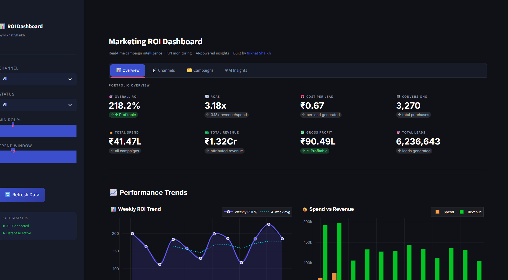
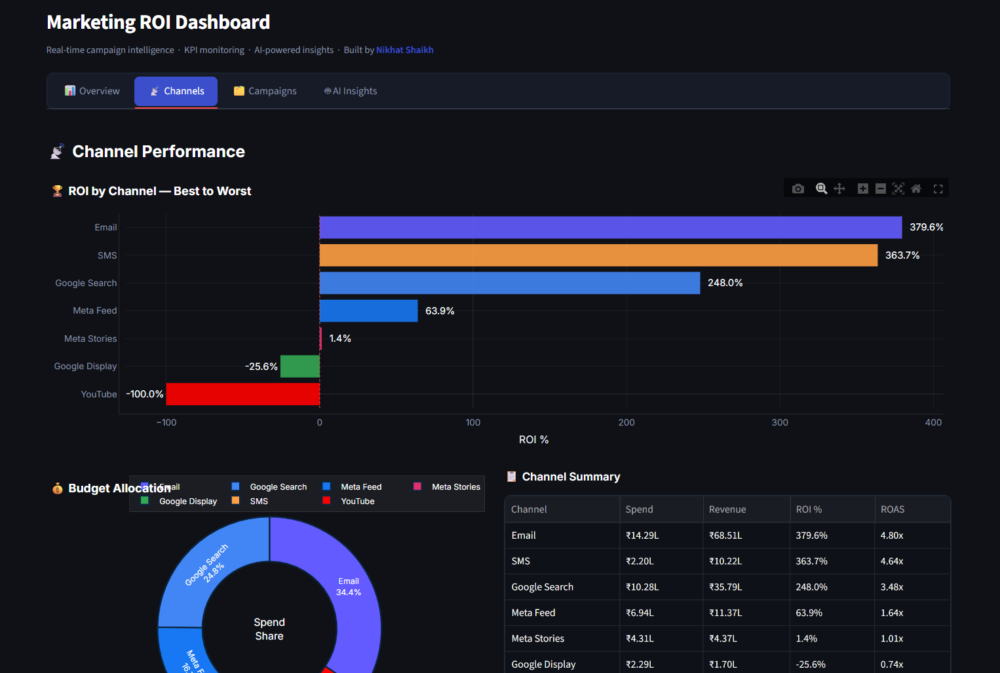
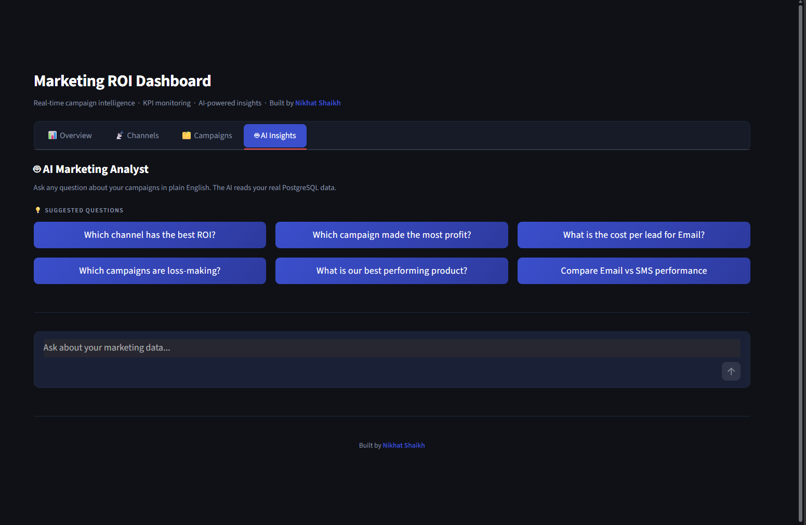

<div align="center">


<p align="center">
  
  
  
  
  
  
</p>

<p align="center">
  
  
  
  
  
  
</p>

<p align="center">
  <a href="https://linkedin.com/in/YOUR_LINKEDIN_SLUG">
    
  </a>
  <a href="mailto:YOUR_EMAIL_HERE">
    
  </a>
  <a href="https://YOUR_PORTFOLIO_URL">
    
  </a>
  <a href="https://github.com/YOUR_GITHUB_USERNAME">
    
  </a>
</p>

<br/>


```bash
git clone https://github.com/buildwithnikhat/marketing-roi-dashboard.git
cd marketing-roi-dashboard
./scripts/init.sh
# 🚀 Dashboard live at http://localhost:8501
```

</div>

---

## 🎯 The Business Problem I Solved

> *Marketing teams I studied spend 3 days per week manually pulling data from Google Ads, Meta, and CRM into Excel. By the time the report is ready, the data is stale — and campaigns running at negative ROI go unnoticed for weeks.*

**Before this system:**

| Pain Point | Reality |
|---|---|
| 📊 Reporting time | 3 days of manual Excel work per week |
| 🔀 Data silos | Google Ads, Meta, CRM — all completely separate |
| 🤔 Decision speed | "Which channel is profitable?" takes 2 days to answer |
| 💸 Budget waste | Campaigns at −20% ROI run for weeks undetected |
| 🤖 AI insights | Zero — just raw numbers on a spreadsheet |

**After this system:**

| Outcome | Result |
|---|---|
| ⚡ Reporting time | Real-time, always up to date |
| 🔗 Unified data | All channels in one PostgreSQL database |
| 🚀 Decision speed | Answer any question in under 3 seconds |
| 💰 ROI visibility | Every campaign tracked, loss-makers flagged instantly |
| 🧠 AI analyst | Ask "Why did ROI drop?" in plain English — get a real answer |

---

## 📸 Screenshots

<!-- ════════════════════════════════════════════════════════════
     📌 REPLACE THIS SECTION WITH YOUR ACTUAL SCREENSHOTS
     
     HOW TO ADD SCREENSHOTS:
     1. Run: ./scripts/init.sh
     2. Open: http://localhost:8501
     3. Take screenshots:
        Windows → Win + Shift + S
        Mac     → Cmd + Shift + 4
        Linux   → Flameshot or Gnome Screenshot
     4. Create folder: mkdir screenshots
     5. Save with these exact filenames
     6. git add screenshots/ && git commit -m "add: screenshots"
     ════════════════════════════════════════════════════════════ -->

<!--### 🎬 Live Demo


### 📊 Dashboard Overview — KPI Cards


### 📈 ROI Trend + Spend vs Revenue


### 📡 Channel Performance Comparison


### 🤖 AI Analyst in Action


### 🚨 Anomaly Detection Panel


> **📌 To record your demo.gif (free tool):**
> Download [LICEcap](https://www.cockos.com/licecap/) → drag frame over browser → record 45s walkthrough → save as `screenshots/demo.gif`

---
-->
## 🏗️ System Architecture

```
┌─────────────────────────────────────────────────────────────────────┐
│                    END-TO-END ARCHITECTURE                          │
│                                                                     │
│  DATA SOURCES          ETL LAYER              STORAGE               │
│  ─────────────         ──────────             ───────               │
│  Google Ads API ──►                                                 │
│  Meta Ads API   ──►   Python ETL         ──►  PostgreSQL 16         │
│  CSV / Kaggle   ──►   • Validate                4 core tables       │
│  Synthetic Gen  ──►   • Transform               5 KPI views         │
│                       • Quarantine bad rows     Indexed for speed   │
│                                                                     │
│  KPI SQL LAYER         REST API LAYER         PRESENTATION          │
│  ──────────────        ──────────────         ────────────          │
│  SQL Views        ──►  FastAPI           ──►  Streamlit Dashboard   │
│  ROI, CPL, CAC         /api/v1/kpis            KPI Cards            │
│  ROAS, Anomalies       /api/v1/channels         Plotly Charts        │
│  Trend Analysis        /api/v1/ai/query         AI Chat Panel        │
│                        In-memory cache          CSV Export           │
│                                                                     │
│  AI INTELLIGENCE PIPELINE                                           │
│  ─────────────────────────                                          │
│  Question ──► SQL Generator (Claude, temp=0) ──► SQL Validator      │
│  ──► PostgreSQL Executor ──► Insight Generator (Claude, temp=0.3)   │
│  ──► Business answer in plain English + supporting data             │
└─────────────────────────────────────────────────────────────────────┘
```

---

## ✨ Features

<table>
<tr>
<td width="50%" valign="top">

### 📊 Real-Time KPI Cards
- Overall ROI, ROAS, CPL, CAC
- Gross profit tracking
- Budget utilization alerts
- Week-over-week delta indicators

### 📈 Interactive Charts
- Weekly ROI trend with rolling average
- Spend vs Revenue grouped bars
- Channel efficiency scatter map
- Budget allocation donut chart

</td>
<td width="50%" valign="top">

### 🤖 AI Marketing Analyst
- Natural language questions
- Auto-generates PostgreSQL SQL
- Returns business-language insights
- Self-heals on SQL errors

### 🚨 Anomaly Detection
- Z-score statistical analysis
- Flags outlier campaign days
- Identifies loss-making campaigns
- Budget pacing alerts (over/under)

</td>
</tr>
</table>

---

## 📐 KPI Definitions

| KPI | Formula | Business Question It Answers |
|-----|---------|------------------------------|
| **ROI** | `(Revenue − Spend) / Spend × 100` | Is this campaign profitable? |
| **ROAS** | `Revenue / Spend` | How much revenue per ₹1 spent? |
| **CPL** | `Spend / Leads` | How much does one lead cost? |
| **CAC** | `Spend / New Customers` | How much to acquire one customer? |
| **Conv Rate** | `Conversions / Clicks × 100` | What % of clicks became sales? |
| **LTV:CAC** | `Avg Lifetime Value / CAC` | Is this customer profitable long-term? |

> 📌 **Industry benchmark:** LTV:CAC ≥ 3× = Healthy business. < 1× = Losing money per customer.

---

## 🤖 How the AI Pipeline Works

```
User: "Which channel had the best ROI last month?"
         │
         ▼
┌─────────────────────────┐
│   SQL GENERATOR         │  Claude Sonnet · temperature = 0
│   Schema context + NL   │  Deterministic — no creativity in SQL
│   → precise SQL query   │
└─────────────────────────┘
         │
         ▼
┌─────────────────────────┐
│   SQL VALIDATOR         │  Blocks: DROP · DELETE · INSERT
│   Safety + whitelist    │  UPDATE · pg_user · multi-statement
└─────────────────────────┘
         │
         ▼
┌─────────────────────────┐
│   SQL EXECUTOR          │  15s timeout · 500 row hard limit
│   PostgreSQL query      │  Self-heals on syntax errors
└─────────────────────────┘
         │
         ▼
┌─────────────────────────┐
│   INSIGHT GENERATOR     │  Claude Sonnet · temperature = 0.3
│   Data → Business lang  │  Specific numbers + recommendation
└─────────────────────────┘
         │
         ▼
Answer: "Email delivered the highest ROI at 342.5%, outperforming
Google Search (287.3%) by 55 percentage points. Despite the lowest
spend at ₹2.85L, it generated ₹12.6L in revenue — a 4.4× ROAS.
Recommendation: Reallocate 15-20% of Meta Stories budget to Email."
```

---

## 🛠️ Tech Stack

| Layer | Technology | Why This Choice |
|-------|-----------|----------------|
| **Database** | PostgreSQL 16 | ACID, window functions, analytics-optimized |
| **ETL** | Python + Pandas | Quarantine pattern, vectorized transforms |
| **KPI Layer** | SQL Views | Business logic in DB — not application code |
| **Backend** | FastAPI | Async, auto-docs at `/docs`, Pydantic validation |
| **Caching** | In-memory TTL | 10× fewer DB queries per dashboard refresh |
| **Dashboard** | Streamlit + Plotly | Rapid BI-grade interactive visualizations |
| **AI** | Anthropic Claude | Two-call NL→SQL→Insight pattern |
| **Deployment** | Docker Compose | One-command local + AWS production deploy |
| **Proxy** | Nginx | SSL termination, routing, WebSocket support |

---

## 🚀 Quick Start

### Prerequisites

```bash
docker --version          # Docker 24+ required
docker-compose --version  # Docker Compose 2+ required

# Get your free Anthropic API key:
# → https://console.anthropic.com → API Keys → Create Key
```

### 3-Step Installation

**Step 1 — Clone**
```bash
git clone https://github.com/YOUR_GITHUB_USERNAME/marketing-roi-dashboard.git
cd marketing-roi-dashboard
```

**Step 2 — Configure**
```bash
cp .env.example .env
# Open .env and set:
#   ANTHROPIC_API_KEY=sk-ant-api03-your-key
#   DB_PASSWORD=your_strong_password
```

**Step 3 — Launch**
```bash
chmod +x scripts/init.sh
./scripts/init.sh
```

This single script:
- ✅ Builds all Docker images
- ✅ Starts PostgreSQL and creates schema
- ✅ Generates 10,000+ rows of realistic synthetic data
- ✅ Runs the full ETL pipeline
- ✅ Launches FastAPI + Streamlit
- ✅ Verifies all services are healthy

**Access:**

| Service | URL |
|---------|-----|
| 📊 Dashboard | http://localhost:8501 |
| ⚡ API | http://localhost:8000 |
| 📖 API Docs | http://localhost:8000/docs |

---

## 📁 Project Structure

```
marketing-roi-dashboard/
│
├── 📂 ingestion/               ETL Pipeline
│   ├── synthetic_data_generator.py
│   ├── extractor.py
│   ├── validator.py
│   ├── transformer.py
│   ├── loader.py
│   └── etl_pipeline.py
│
├── 📂 db/                      Database Layer
│   ├── schema.sql
│   └── db_setup.py
│
├── 📂 kpi/                     SQL KPI Layer
│   ├── 01_base_views.sql
│   ├── 02_kpi_views.sql
│   └── 03_analytical_queries.sql
│
├── 📂 api/                     FastAPI Backend
│   ├── main.py
│   ├── config.py
│   ├── models/
│   ├── routers/
│   └── services/
│
├── 📂 dashboard/               Streamlit Frontend
│   ├── app.py
│   ├── api_client.py
│   ├── components/
│   └── utils/
│
├── 📂 ai/                      AI Intelligence Layer
│   ├── insight_engine.py
│   ├── sql_validator.py
│   ├── sql_executor.py
│   ├── llm_providers.py
│   └── prompts/
│
├── 📂 docker/                  Dockerfiles
├── 📂 scripts/                 init · deploy · backup
├── docker-compose.yml
├── docker-compose.prod.yml
├── nginx/nginx.conf
└── .env.example
```

---

## 💻 Commands Reference

```bash
# Start / Stop
docker-compose up -d                    # Start everything
docker-compose down                     # Stop (data preserved)
docker-compose restart api              # Restart one service

# Logs
docker-compose logs -f                  # All services
docker-compose logs -f api              # API only

# Data
docker-compose run --rm etl \
  python ingestion/etl_pipeline.py data/raw    # Run ETL manually

docker-compose exec db \
  psql -U postgres marketing_roi_db            # Open DB shell

# Test AI endpoint
curl -X POST http://localhost:8000/api/v1/ai/query \
  -H "Content-Type: application/json" \
  -d '{"question": "Which channel has the best ROI?"}'

# Run AI regression tests
docker-compose exec api python ai/tests/test_ai_pipeline.py
```

---

## ☁️ Deploy to AWS EC2

```bash
# 1. Launch EC2 → Amazon Linux 2023 → t3.medium → download .pem

# 2. Open Security Group:
#    Port 22   (SSH — your IP only)
#    Port 8000 (API — public)
#    Port 8501 (Dashboard — public)

# 3. Configure deploy script
nano scripts/deploy.sh   # Set EC2_HOST and SSH_KEY

# 4. Deploy
chmod +x scripts/deploy.sh && ./scripts/deploy.sh
# ✅ Live at http://your-ec2-ip:8501
```

---

## 🏢 Industry Patterns Implemented

| Pattern | Where Used | Why It Matters |
|---------|-----------|---------------|
| **Kimball Star Schema** | Database | Analytics-optimized, fast KPI queries |
| **ETL with Quarantine** | Ingestion | Never silently discard bad data |
| **UPSERT Idempotency** | Data loading | Re-runnable pipelines, zero duplicates |
| **Service Layer** | FastAPI | Business logic decoupled from HTTP |
| **Envelope Response** | API | Consistent JSON shape on every endpoint |
| **Two-LLM-Call Pattern** | AI | SQL generation + narrative insight separated |
| **SQL Safety Validation** | AI security | Blocks all write ops from AI-generated SQL |
| **Self-Healing SQL** | AI reliability | Auto-retries with PostgreSQL error context |
| **Multi-Stage Docker** | Deployment | Lean images, non-root user security |
| **12-Factor App Config** | Settings | Environment vars, zero hardcoded secrets |
| **NULLIF Division Guard** | KPI SQL | Prevents division-by-zero in every formula |
| **Z-Score Anomaly Detection** | Analytics | Statistical outlier identification |

---

## 💡 Sample AI Questions to Try

```
Performance:
  → "Which channel had the best ROI last month?"
  → "What are our top 5 campaigns by revenue?"
  → "Which campaigns are currently loss-making?"

Cost Efficiency:
  → "What is the cost per lead for each channel?"
  → "Which campaign has the lowest CAC?"
  → "Where are we overspending relative to revenue?"

Trends:
  → "Is our overall ROI improving over the last 8 weeks?"
  → "What was our best performing month this year?"
  → "Which day of the week has the highest conversion rate?"

Optimization:
  → "Which channel should we increase budget for?"
  → "Which active campaigns are underpacing their budget?"
  → "Which product line generates the highest ROAS?"
```

---

## 🗺️ Roadmap

- [ ] Google Ads API live connector
- [ ] Meta Ads API live connector
- [ ] Streaming AI responses (word-by-word output)
- [ ] Daily KPI email digest via SMTP
- [ ] PDF report export
- [ ] Redis caching for horizontal scaling
- [ ] Multi-tenant / multi-client support

---

## 🤝 Contributing

```bash
git checkout -b feature/your-feature-name
git commit -m "feat: describe your change"
# Open Pull Request
```

Commit convention: `feat` · `fix` · `docs` · `refactor` · `test` · `chore`

---

## 📄 License

MIT License — free for personal and commercial use. See `LICENSE` for full text.

---

<div align="center">

## 👩‍💻 About Me


<br/>

**Nikhat Shaikh**

*AI / ML Engineer · India*

I build end-to-end AI and data systems — from raw data pipelines to
LLM-powered analytics dashboards — using real industry-grade patterns.

<br/>

[](https://linkedin.com/in/YOUR_LINKEDIN_SLUG)
[](mailto:YOUR_EMAIL_HERE)
[](https://YOUR_PORTFOLIO_URL)
[](https://github.com/YOUR_GITHUB_USERNAME)

<br/>

*Open to freelance projects · Full-time roles · Consulting engagements*

</div>

---

## ⭐ Support This Project

If this helped you learn or saved you time:

- ⭐ **Star this repo** — helps others discover it
- 🍴 **Fork it** — build your own version
- 🐛 **Open issues** — bugs, features, questions
- 📢 **Share on LinkedIn** — tag me, I'll reshare

---

<div align="center">


**Built by Nikhat Shaikh · AI / ML Engineer · India**

*Marketing ROI Dashboard · Python · FastAPI · PostgreSQL · Streamlit · Claude AI · Docker*

*From raw campaign data to AI-powered business decisions — in one command.*

</div>

---

<!--
╔══════════════════════════════════════════════════════════════╗
║           📌 QUICK REPLACEMENT GUIDE — DO THIS FIRST        ║
║                                                              ║
║  Search for these exact strings and replace them:           ║
║                                                              ║
║  YOUR_GITHUB_USERNAME  →  your actual GitHub username       ║
║  YOUR_LINKEDIN_SLUG    →  the part after linkedin.com/in/   ║
║  YOUR_EMAIL_HERE       →  your@email.com                    ║
║  YOUR_PORTFOLIO_URL    →  https://yoursite.com              ║
║                                                              ║
║  Tip: Ctrl+F → search "YOUR_" → replace all 4 at once       ║
║                                                              ║
║  Then add screenshots/ folder with:                         ║
║    demo.gif                    (record with LICEcap)         ║
║    01_dashboard_overview.png                                 ║
║    02_roi_trend_chart.png                                    ║
║    03_channel_comparison.png                                 ║
║    05_ai_query_demo.png                                      ║
║    06_anomaly_detection.png                                  ║
╚══════════════════════════════════════════════════════════════╝

LINKEDIN POST — COPY THIS WHEN YOU PUBLISH:
═══════════════════════════════════════════

🚀 Just shipped something I'm really proud of:

An AI-powered Marketing ROI Dashboard that answers
"Which campaign is actually making us money?" in under 3 seconds.

The real problem I solved:
Marketing teams spend 3 days/week in Excel.
Campaigns at -20% ROI go unnoticed for weeks.
By the time the report is ready, the data is already stale.

What I built end-to-end:
📊 Unified data from Google Ads, Meta, Email, SMS
⚡ Real-time ROI, CPL, CAC, ROAS — all auto-calculated
🤖 AI Analyst: ask questions in plain English, get real answers
🚨 Anomaly detection: flags outlier campaigns using z-score stats
🐳 One-command Docker deployment — runs anywhere

Tech I used:
Python → PostgreSQL → FastAPI → Streamlit → Claude AI → Docker

Hardest part? The AI safety layer.
LLMs can generate DROP TABLE commands.
I built a validator that blocks ALL write operations before
any AI-generated SQL touches the database. Non-negotiable.

15+ real industry patterns implemented:
✅ Kimball Star Schema for analytics databases
✅ ETL with quarantine (never silently discard bad data)
✅ UPSERT idempotency (pipelines are always re-runnable)
✅ Two-LLM-call pattern (SQL generation + insight separated)
✅ Multi-stage Docker builds for lean, secure images
✅ NULLIF division guard in every KPI formula

Full source code on GitHub:
👉 github.com/YOUR_GITHUB_USERNAME/marketing-roi-dashboard

What would you add to this system next?

#Python #DataEngineering #AIEngineer #MachineLearning
#FastAPI #Streamlit #PostgreSQL #Docker #AnthropicAI
#MarketingAnalytics #BuildInPublic #OpenSource #India
-->
"# marketing-roi-dashboard" 
