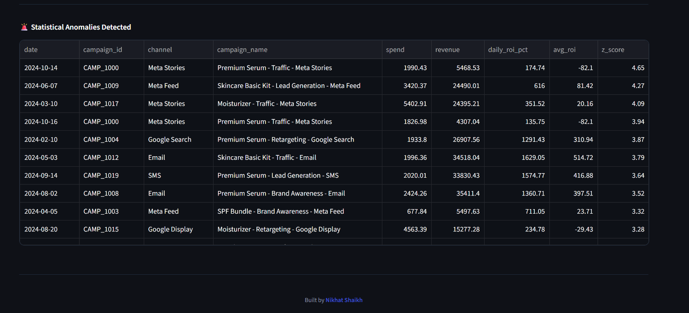

````md
<div align="center">


<p align="center">
  
  
  
  
  
  
</p>

<p align="center">
  
  
  
  
  
  
</p>

<p align="center">
  <a href="https://linkedin.com/in/YOUR_LINKEDIN_SLUG">
    
  </a>
  <a href="mailto:YOUR_EMAIL_HERE">
    
  </a>
  <a href="https://YOUR_PORTFOLIO_URL">
    
  </a>
  <a href="https://github.com/YOUR_GITHUB_USERNAME">
    
  </a>
</p>

<br/>


```bash
git clone https://github.com/buildwithnikhat/marketing-roi-dashboard.git
cd marketing-roi-dashboard
./scripts/init.sh
# 🚀 Dashboard live at http://localhost:8501
````

</div>

---

## 🎯 The Business Problem I Solved

> *Marketing teams I studied spend 3 days per week manually pulling data from Google Ads, Meta, and CRM into Excel. By the time the report is ready, the data is stale — and campaigns running at negative ROI go unnoticed for weeks.*

**Before this system:**

| Pain Point        | Reality                                               |
| ----------------- | ----------------------------------------------------- |
| 📊 Reporting time | 3 days of manual Excel work per week                  |
| 🔀 Data silos     | Google Ads, Meta, CRM — all completely separate       |
| 🤔 Decision speed | "Which channel is profitable?" takes 2 days to answer |
| 💸 Budget waste   | Campaigns at −20% ROI run for weeks undetected        |
| 🤖 AI insights    | Zero — just raw numbers on a spreadsheet              |

**After this system:**

| Outcome           | Result                                                       |
| ----------------- | ------------------------------------------------------------ |
| ⚡ Reporting time  | Real-time, always up to date                                 |
| 🔗 Unified data   | All channels in one PostgreSQL database                      |
| 🚀 Decision speed | Answer any question in under 3 seconds                       |
| 💰 ROI visibility | Every campaign tracked, loss-makers flagged instantly        |
| 🧠 AI analyst     | Ask "Why did ROI drop?" in plain English — get a real answer |

---

## 📸 Screenshots

<div align="center">

### 📊 Dashboard Overview — KPI Cards


<br/><br/>

### 📈 ROI Trend + Spend vs Revenue


<br/><br/>

### 📡 Channel Performance Comparison


<br/><br/>

### 🚨 Anomaly Detection Panel



</div>

---

## 🏗️ System Architecture

```text
┌─────────────────────────────────────────────────────────────────────┐
│                    END-TO-END ARCHITECTURE                         │
│                                                                     │
│  DATA SOURCES          ETL LAYER              STORAGE               │
│  ─────────────         ──────────             ───────               │
│  Google Ads API ──►                                                 │
│  Meta Ads API   ──►   Python ETL         ──►  PostgreSQL 16         │
│  CSV / Kaggle   ──►   • Validate                4 core tables       │
│  Synthetic Gen  ──►   • Transform               5 KPI views         │
│                       • Quarantine bad rows     Indexed for speed   │
│                                                                     │
│  KPI SQL LAYER         REST API LAYER         PRESENTATION          │
│  ──────────────        ──────────────         ────────────          │
│  SQL Views        ──►  FastAPI           ──►  Streamlit Dashboard   │
│  ROI, CPL, CAC         /api/v1/kpis            KPI Cards            │
│  ROAS, Anomalies       /api/v1/channels        Plotly Charts        │
│  Trend Analysis        /api/v1/ai/query        AI Chat Panel        │
│                        In-memory cache          CSV Export           │
│                                                                     │
│  AI INTELLIGENCE PIPELINE                                           │
│  ─────────────────────────                                          │
│  Question ──► SQL Generator ──► SQL Validator                       │
│  ──► PostgreSQL Executor ──► Insight Generator (temp=0.3)           │
│  ──► Business answer in plain English + supporting data             │
└─────────────────────────────────────────────────────────────────────┘
```

---

## 🤖 How the AI Pipeline Works

```text
User: "Which channel had the best ROI last month?"
         │
         ▼
┌─────────────────────────┐
│   SQL GENERATOR         │  temperature = 0
│   Schema context + NL   │  Deterministic — no creativity in SQL
│   → precise SQL query   │
└─────────────────────────┘
         │
         ▼
┌─────────────────────────┐
│   SQL VALIDATOR         │  Blocks: DROP · DELETE · INSERT
│   Safety + whitelist    │  UPDATE · pg_user · multi-statement
└─────────────────────────┘
         │
         ▼
┌─────────────────────────┐
│   SQL EXECUTOR          │  15s timeout · 500 row hard limit
│   PostgreSQL query      │  Self-heals on syntax errors
└─────────────────────────┘
         │
         ▼
┌─────────────────────────┐
│   INSIGHT GENERATOR     │  temperature = 0.3
│   Data → Business lang  │  Specific numbers + recommendation
└─────────────────────────┘
         │
         ▼

Answer: "Email delivered the highest ROI at 342.5%, outperforming
Google Search (287.3%) by 55 percentage points. Despite the lowest
spend at ₹2.85L, it generated ₹12.6L in revenue — a 4.4× ROAS.
Recommendation: Reallocate 15-20% of Meta Stories budget to Email."
```
